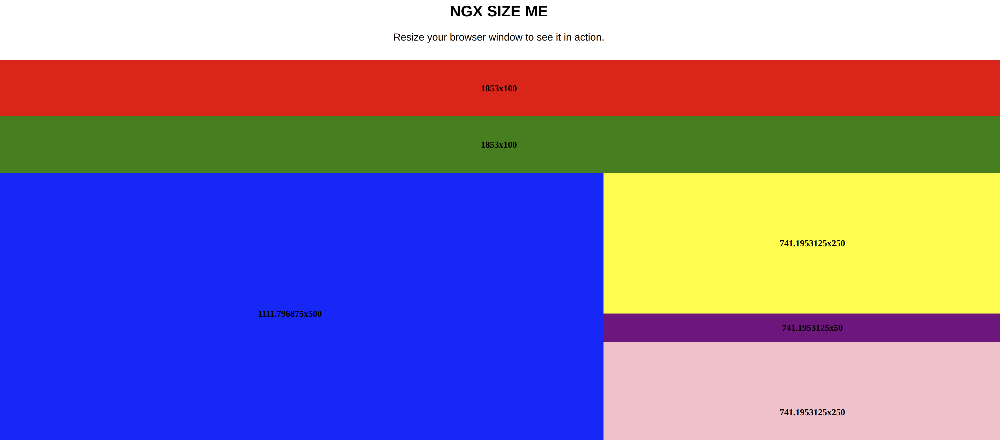

[](https://github.com/eisberg-labs/ngx-size-me/actions/workflows/ci.yml)
[](https://www.linkedin.com/in/anamarjanica/)
# Ngx Size Me

> Responsive component for Angular, inspired by [react-size-me](https://github.com/ctrlplusb/react-size-me). Lightweight
> angular directive that makes your components aware of width, height and position.


If you 👍 this project, consider giving it a ★, thanks! 🙌

## Table of Contents

- [Installation](#installation)
- [Usage](#usage)
- [Demo](#demo)
- [API](#api)
- [Code of Conduct](#code-of-conduct)
- [Contributing](#contributing)
- [Sponsors](#sponsors)
- [Contact](#contact)
- [License](#license)


## Installation

```bash
npm install @eisberg-labs/ngx-size-me --save
```

## Usage

First import to your module:

```typescript
@NgModule({
  declarations: [
    AppComponent
  ],
  imports: [
    BrowserModule,
    SizeMeModule
  ],
  providers: [],
  bootstrap: [AppComponent]
})
export class AppModule {
}

```

Then, use the directive in your component's HTML:

```typescript
<div sizeMe (resize)="logResize($event)"></div>
```

## Demo

[View Demo and Documentation](https://ngx-size-me.amarjanica.com)

## Api

|Option | Data type | Description|
|-------|-----------|------------|
|**monitorWidth** | number | if true, any changes to your component's width will trigger a recalculation|
|**monitorHeight** | boolean | if true, any changes to your component's height will trigger a recalculation|
|**refreshRate** | number | Frequency of detecting element changes (milliseconds). Default is 16ms.|
|**refreshMode** | 'throttle' or 'debounce' | Mode in which refreshing should occur.|

When recalculation is triggered, directive's state is updated with new width, height and position (left, right, top,
bottom).
When a state is updated, component can be notified either by binding an event trigger like:

```typescript
<div sizeMe (resize)="logResize($event)" > </div>

```

Or by binding updates to a property:

```typescript
<div sizeMe [state]="size"></div>
```

## Code of Conduct

I follow the [Rust Code of Conduct](http://www.rust-lang.org/conduct.html).

## Contributing

Everyone is welcome to contribute. You can read more about [contributing here](./CONTRIBUTING.md).

## Sponsors

If you find this project useful, give it a star. You could also consider supporting us through the following platforms:
- [Become a GitHub Sponsor](https://github.com/sponsors/amarjanica)
- [Support me on Patreon](https://www.patreon.com/amarjanica)

As this project grows, I will showcase sponsors' logos and links in this section. Thank you for your support!

## Contact

Feel free to reach out to me on [LinkedIn](https://www.linkedin.com/in/anamarjanica/).

## License

This project is [MIT licensed](./LICENSE).


